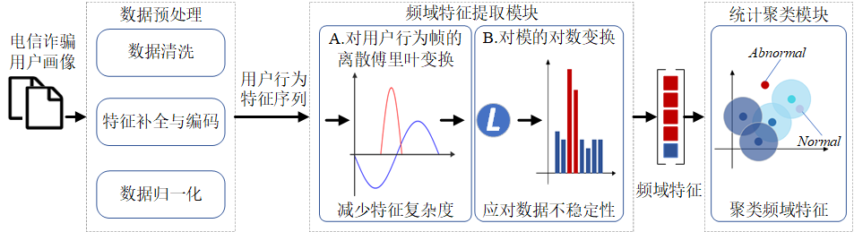

# 基于频域分析和聚类的轻量化电信诈骗检测系统

## 项目背景

随着电信诈骗案件的日益增多，为了保护用户安全并减少经济损失，本团队开发了一款基于频域分析和聚类的轻量化电信诈骗用户检测系统。该系统采用离散傅里叶变换提取电信用户行为的频域特征，并进行对数变换，以增强模型的数值稳定性并降低信息损失。借助轻量化聚类算法，本系统可以学习并识别正常用户的行为模式，实时发现异常行为，从而有效地识别潜在的诈骗活动。

## 目录结构

```
├── 数据大屏
	├── static
	├── templates
	├── app.py
	├── corp.json
	├── data.py
	├── job.json
├── CombinedData.py
├── Data4WebJson.py
├── DFT.py
├── requirements.txt
└── RandomForest.py
```

## 文件描述

- `app.py`: Flask 应用的主要入口点，负责设置路由和渲染模板。
- `corp.json` & `job.json`: 存储可视化相关信息的 JSON 文件。
- `static`: 包含静态资源如 CSS 和 JavaScript 文件。
- `templates`: 存放 HTML 模板文件。
- `CombinedData.py`: 处理和合并不同来源的数据。
- `Data4WebJson.py`: 将数据转换为适合 Web 展示的 JSON 格式。
- `DFT.py`: 涉及数据频域分析模块。
- `RandomForest.py`: 使用随机森林算法对数据进行分析或预测。

## 安装与运行

1. 克隆仓库到本地：

   ```
   git clone https://github.com/HlzlQ/TeleScamDetect.git
   ```

2. 安装依赖项：

   ```
   pip install -r requirements.txt
   ```

3. 运行应用程序：

   ```
   python app.py
   ```

4. 打开浏览器并访问 [http://localhost:5000](http://localhost:5000/) 来查看数据大屏。

## 主要功能

1. **鲁棒准确地检测**：系统能够准确检测甚至预测电信诈骗行为，在面对任务不确定时，仍然可以捕获电信诈骗行为。
2. **轻量化实时地检测**：检测模型轻量化，低复杂度和低内存占用，具有较低的检测延迟。
3. **增量更新**：系统能依据电信数据进行检测模型的增量更新，动态调整，不断适应用户数据的迭代。

## 技术方案



### 1. 数据预处理模块

- **数据清洗**：去除噪声数据、空值及异常值。
- **特征补全与编码**：数值型特征进行插值或均值填补，类别型特征进行独热编码和标签编码。
- **数据归一化**：对数值型特征进行归一化操作，保证模型训练的稳定性。

### 2. 频域特征提取模块

- **DFT变换**：将时间序列数据转换到频域空间中，捕捉用户行为中的周期性模式。
- **特征降维**：保留前一半的频域特征，减少特征维度，保留核心信息。
- **对数变换**：对频域特征的模量进行对数变换，防止数值不稳定问题。

### 3. 统计聚类模块

- **轻量化聚类模型**：仅使用正常用户的频域特征进行聚类，学习正常用户的行为模式。
- **模型训练与聚类中心更新**：不断优化聚类中心，支持在线训练和动态增量更新，适应用户行为的变化。

## 实验结果

- **模型性能**：
  - 基于随机森林的分类模型：Precision 0.76, Recall 0.83, F1-score 0.79
  - 基于频域分析和聚类的检测模型：ROC曲线下面积为0.82
- **系统运行时间**：
  - 基于随机森林的分类模型：166.36秒
  - 基于频域分析和聚类的检测模型：0.748秒

## 结论与展望

本系统通过实现实时的行为监测和异常识别，有效提升了对电信诈骗行为的防控能力。未来，我们将继续优化系统，实现长效治理机制，降低电信网络诈骗带来的风险与危害。

## 团队信息

- **团队名称**：Timi启动
- **所在省份**：河南
- **赛道名称**：人工智能赛道

## 参考文献

- [1] 最高人民检察院. 检察机关打击治理电信网络诈骗及其关联犯罪工作情况（2023年）. 中华人民共和国最高人民检察院. https://www.spp.gov.cn/xwfbh/wsfbt/202311/t20231130_635181.shtml#1
- [2] KARAHOCA A, YALCIN S, KAHRAMAN C, et al. Fraud Detection Using an Adaptive Neuro-Fuzzy Inference System in Mobile Telecommunication Networks[M]//Information Sciences 2007. 1440-1446.
- [3] Zheng Y J, Zhou X H, Sheng W G, et al. Generative adversarial network based telecom fraud detection at the receiving bank[J]. Neural Networks, 2018, 102: 78-86.
- [4] Liu M, Liao J, Wang J, et al. AGRM: attention-based graph representation model for telecom fraud detection[C]//ICC 2019-2019 IEEE International Conference on Communications (ICC). IEEE, 2019: 1-6.
- [5] Arafat M, Qusef A, Sammour G. Detection of wangiri telecommunication fraud using ensemble learning[C]//2019 IEEE Jordan International Joint Conference on Electrical Engineering and Information Technology (JEEIT). IEEE, 2019: 330-335.
- [6] Guo K, Wang W. Research on Telecom Fraud Detection Model Based on Cellular Network Data[J]. Journal of Networking and Telecommunications, 2020, 2(1): 12-17.
- [7] Jiang Y, Liu G, Wu J, et al. Telecom fraud detection via hawkes-enhanced sequence model[J]. IEEE Transactions on Knowledge and Data Engineering, 2022, 35(5): 5311-5324.
- [8] Hu X, Chen H, Chen H, et al. Telecom fraud detection via imbalanced graph learning[C]//2022 IEEE 22nd International Conference on Communication Technology (ICCT). IEEE, 2022: 1312-1317.
- [9] Li R, Chen H, Liu S, et al. TFD-IIS-CRMCB: telecom fraud detection for incomplete information systems based on correlated relation and maximal consistent block[J]. Entropy, 2023, 25(1): 112.
- [10] Hu X, Chen H, Zhang J, et al. GAT-COBO: Cost-sensitive graph neural network for telecom fraud detection[J]. IEEE Transactions on Big Data, 2024.
- [11] SUBUDHI S, PANIGRAHI S. Quarter-sphere support vector machine for fraud detection in mobile telecommunication networks[J]. Procedia Computer Science, 2015, 48: 353-359.
- [12] JI S, LI J, YUAN Q, et al. Multi-range gated graph neural network for telecommunication fraud detection[C]//Proceedings of the 33rd International Joint Conference on Neural Networks (IJCNN). IEEE, 2020: 1-6.
- [13] 中国信息通信研究院. 新形势下电信网络诈骗治理研究报告（2020年）[R]. 北京: 中国信息通信研究院, 2020.